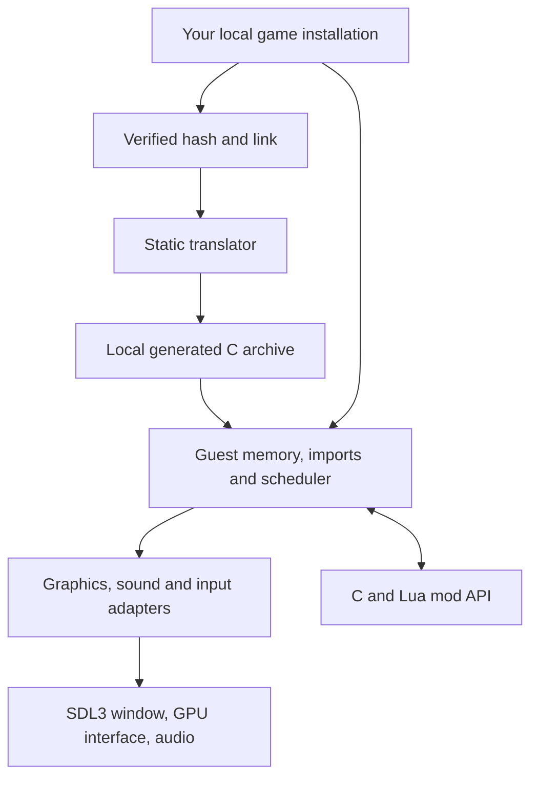

# Architecture

The build translates the supported executable's x86 instructions into C, then
compiles that C alongside a handwritten native runtime. At runtime the executable
supplies the original data image; its machine instructions are not executed by an
x86 emulator. The loader verifies its hash before mapping any of it.

## Guest memory and calls

`runtime/memory.cpp` owns the guest address arena and allocator. Guest pointers
remain 32-bit offsets even in a 64-bit process. The arena sits at one fixed host
address (`RECOMP_ARENA` in `runtime/x86.h`), so translated accessors index a
constant instead of reloading a base pointer after every guest store; anything
that maps guest memory, including test harnesses, reserves exactly that range
through `os_vm_reserve_at`, and code that runs guest functions against other
memory swaps it in with `recomp_arena_swap`. `loader.cpp` maps PE sections,
zero-fills data tails and replaces import-table entries with runtime trampolines.
`imports.cpp` decodes calls and dispatches the original calling conventions.

`runtime/x86.h` defines the register file, flags, x87 state and
instruction helpers used by generated functions. Functions retain stable guest
addresses for dispatch, hooks and diagnostics. Those addresses are identifiers,
not host pointers and not evidence of human-recovered intent.

Generated callers use `entry_ADDR` thunks. Those small, separately compiled
thunks supply the current dense table index to one per-image dispatch function;
hook checks, profiling and frame diagnostics no longer expand at every call.
The base-pointer table selects native replacements, while the raw-pointer table
retains translated originals. Direct, tail and computed transfers preserve their
guest stack operations. Replacement headers are compilation dependencies of
`table.c` only, in addition to native sources that explicitly include them.

Body chunks contain only local callee declarations, with no global function
list or hook indices. They start in fixed 16 KiB guest-address buckets and
split by address until their emitted bodies fit a 2 MiB source budget.
Oversized functions, including their alternate entries, stay intact in separate
files scheduled first by the build. A change can repack its own bucket, but
cannot move functions across the rest of the image. Dense-index changes can
still rebuild lightweight entry shards and the table. Shared inline semantics
in `x86.h` still require recompiling every body that includes that header.

## Threads and ownership

Original game threads are cooperatively scheduled by `runtime/kernel32.cpp`.
Each has a register file and stack, but **one guest thread holds the execution
baton at a time**. A blocking import yields it. Host workers never mutate guest
memory concurrently with that thread.

The presentation worker consumes completed immutable frames. GPU resources and
texture revisions remain alive until commands that reference them complete.
Audio queues use their own clock and synchronization. Window events publish
requests for the guest thread rather than directly executing guest functions.

## A frame through the host

1. The original game submits DirectDraw/Direct3D operations to `dx/`.
2. `host/d3d_render.cpp` translates draws and texture revisions into GPU commands over `host/gpu/gpu.h`.
3. `host/ui_layer.cpp` extracts UI elements from recorded blits.
4. `host/present_thread.cpp` seals the frame, retains its resources and queues it.
5. `host/compositor.cpp` combines world, UI and overlays for presentation.
6. Completion acknowledgements release resources and update frame-pacing samples.

The Classic profile aspect-fits the selected game resolution. Enhanced can
render the world at drawable resolution with separately scaled UI. Wide view
expands the world only when the drawable is wider than the selected game canvas.
Each game repository documents which rendering profiles its build supports.

## Timing, input and settings

The presentation limit is separate from simulation scheduling. Changing it must
not change the scheduler's guest-time accounting.

`host/input_gate.cpp` maps window coordinates through the published frame layout
and handles edge scrolling and focus. Relative DirectInput counts pass through
unchanged; absolute Win32 positions use the compositor's current guest mapping.
`host/controls/` holds the on-screen controls: a layout model and hit test, a
router that owns each finger, a virtual pad that on-screen and physical
controllers both write to, a binding stage that turns the pad into keys and
mouse (or, in `native` mode, into the DirectInput joystick and XInput devices
in `dx/`), the overlay that draws it and the on-device editor. Everything but
the overlay and the SDL glue is SDL-free and unit-tested in `controls_tests`.
See `docs/superpowers/specs/2026-09-17-touch-controls-design.md`.
`mods/display_settings.cpp` validates host display choices and applies rendering
and projection changes at the frame boundary. `mods/settings.cpp` atomically
persists host and mod settings in the selected profile; each game's own menu can
open the shared settings page through the mod API.

## Discovery, and code a build does not carry

The Ghidra code map is the authority on where code is, and it can miss some: a
function only ever reached through a pointer nothing resolves, a jump-table
slot no listing owns, a block Ghidra ended early. Each shows up at run time as
a call or jump the address table cannot place.

`RECOMP_DISCOVERY=<file>` writes those addresses with the instruction that named
them (`runtime/discovery.h`). They are evidence for the Ghidra analysis: create the
function or entry there, re-export the code map and regenerate; translation never
guesses entry points. Meanwhile `runtime/interp.cpp` runs what the translation
lacks, so a gap costs speed rather than correctness.

## Current boundaries

The original simulation is generated code, not a hand-rewritten gameplay engine.
It intentionally retains low-level register operations. The handwritten runtime,
adapter APIs, build tools and reviewed extension points are the primary places to
contribute. Generated functions have address/symbol comments and per-instruction
provenance; change the translator or a reviewed replacement, then regenerate.

The desktop app builds on macOS, Linux and Windows; the iOS packager runs
on macOS. `src/core/` contains only shared type headers used by the retained
tests; it is not a second game engine. Capture/replay under `mods/native/`
validates prospective native replacements locally.

Platform services (threads, virtual memory, plugins, files, clocks) go through
`platform/os.h`, with POSIX and Win32 implementations; the build is
CMake with presets per platform (`CMakePresets.json`).
